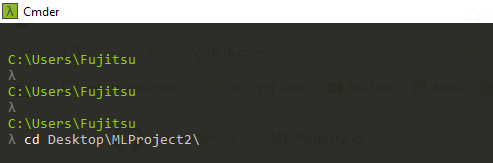
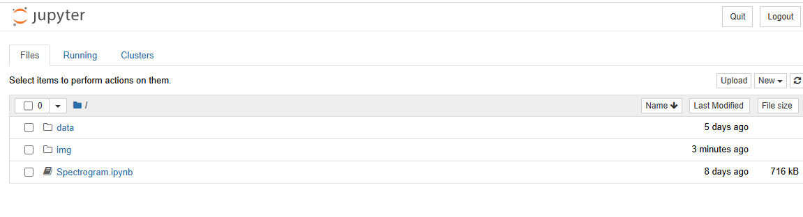
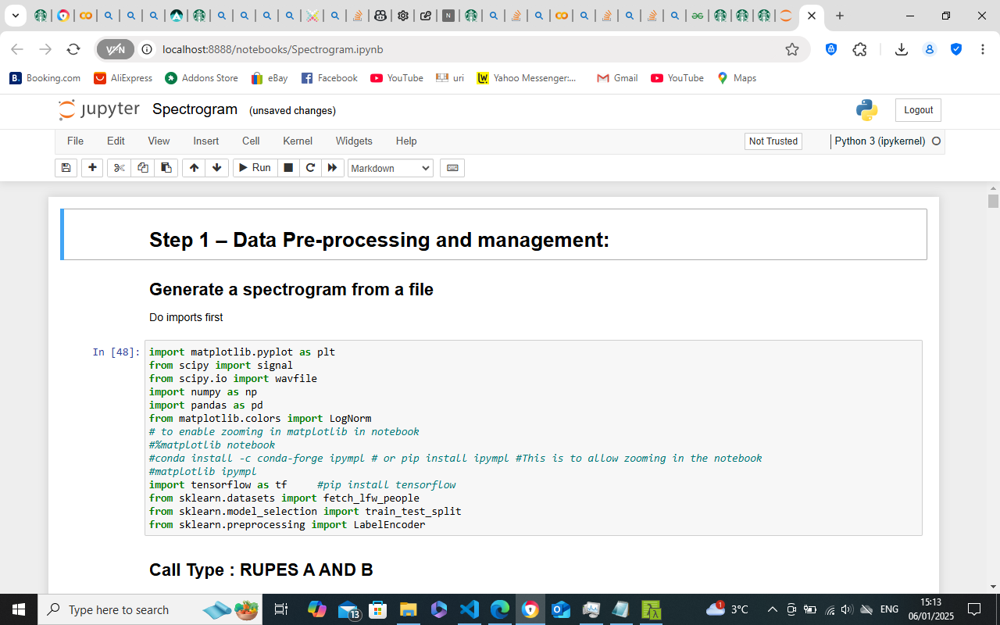

# Module : Machine Learning Project 2

**by Michael Allen (g00425633@atu.ie)**

This repository contains Project 2 for the Machine Learning module.

## PURPOSE
The purpose of the assessment is for you to demonstrate ability in the following.
The purpose of this Machine Learning project is to analyse the recorded dataset and investigate 
whether it’s possible to discriminate between the different seal calls.
It is advised to commence analysis on discriminating the simplest case (e.g. between just 2 
calls – Rupe A and Rupe B or between Rupe B and “no call”) before progressing to further 
analysis. I will provide annotations as well as the raw recordings.
The ultimate goal would be to build a detector that can extract seal calls from an audio 
recording but that will not necessarily be the outcome of this project.
The features provided to a Machine Learning model will be a spectrogram of the calls. For 
consistency, each spectrogram (for each call) should be the same size

## CONTENTS
### Step 1 – Data Pre-processing and management:
The provided uncompressed wav files are large and there is lots of the recordings whether there 
are no calls present.
The first task will be to build a dataset from the annotated data. I’ve provided a jupyter notebook 
that will assist in this regard. 
My advice would be to extract a spectrogram for each call. Each spectrogram should be the 
same size so there will be some pre-pre-processing to find what is the longest call (in time) and 
the broadest in frequency. This will serve as the baseline for the largest spectrogram. Extract 
and save (with the metadata)a spectrogram for each call (you can calculate the central time of 
each call from the metadata). Note, don’t save as images but as a raw 2d array of numbers.
You can also create spectrograms for the extra class “no-call” where you build a set of 
spectrograms from times when there is no annotated call. You may assume that any 
unannotated region has no call in it. Take care to ensure that the extracted“no-call”
spectrograms are from the same frequency region as the call spectrograms.
I would recommend having a single jupyter notebook file that does all this preprocessing.

### Step 2 – Model Training
After you’ve created your dataset of “images”, it’s time to train your model.
Experiment with different hyper-parameters like we did with faces. You could also experiment 
with CNNs/Transfer Learning (on similar models)
Evaluate the performance of the model on a test set.

### Step 3 – Refine
Regardless if step 2 works or not, repeat your process and tune parameters. 
You could try adjusting the parameters in my data-extraction/spectrogram notebook (increasing 
nfft and noverlap will increase the resolution of the spectrogram but will also increase 
computational cost – so you may need to split the wav files (you could use pydub python - break 
up a .wav file by timestamp - Stack Overflow) or try where you can get more computational

## INSTRUCTIONS
### How to clone and run notebook
1. Download and Install Anaconda. Here's the link:
  [Download and Install Anaconda](https://www.anaconda.com/download/)

2. Download and Install Visual Studio Code. Here's the link:
  [Download and Install Visual Studio Code](https://code.visualstudio.com/)

3. Clone Repository as follows:
   -  On GitHub.com, navigate to the main page of the repository.
  
   -  Above the list of files, click Code.
      
  
   -  Copy the URL for the repository.
      
  
   -  Open Git Bash.
  
   -  Change the current working directory to the location where you want the cloned directory.
  
   -  Type `git clone`, and then paste the URL you copied earlier.
  
   -  Press Enter to create your local clone.
      The steps for cloning a repository are detailed in the link below:
      [Cloning a repository](https://docs.github.com/en/repositories/creating-and-managing-repositories/cloning-a-repository)

4. Open Repository in Visual Studio Code
  [Open a repository](https://code.visualstudio.com/docs/sourcecontrol/intro-to-git#_open-a-git-repository)

   Alternatively you can open the repository in a Jupyter notebook.

   Refer to these snapshots for a step-by-step guide to open the repository in a Jupyter notebook:

   - **Step 1**: Change directory. Open `ML-Project2`, directory where the clone is located.
                 `cd ML-Project2`

    

   - **Step 2**: Run command `jupyter notebook`

    

   - **Step 3**: The notebook opens in a web browser. It contains `Spectrogram.ipynb`. Open this notebook.

    

## ISSUES
### Troubleshooting cloning errors

[Troubleshooting cloning errors](https://docs.github.com/en/repositories/creating-and-managing-repositories/troubleshooting-cloning-errors)

If you're having trouble cloning a repository, check these common errors.
1. HTTPS cloning errors
   - Check your Git version
   - Ensure the remote is correct
   - Provide an access token
   - Check your permissions
   - Use SSH instead
 
 2. Error: Repository not found
    - Check your spelling
    - Checking your permissions
    - Check your SSH access
    - Check that the repository really exists
  
 3. Error: Remote HEAD refers to nonexistent ref, unable to checkout

## Research

[1] [Parameters to control the size of a spectrogram](https://stackoverflow.com/questions/51241499/parameters-to-control-the-size-of-a-spectrogram)

[2] [break up a .wav file by timestamp](https://stackoverflow.com/questions/51622865/break-up-a-wav-file-by-timestamp)

[3] [Python: AttributeError: '_io.TextIOWrapper' object has no attribute 'split'](https://stackoverflow.com/questions/17569679/python-attributeerror-io-textiowrapper-object-has-no-attribute-split)

[4] [Reading *.wav files in Python](https://stackoverflow.com/questions/2060628/reading-wav-files-in-python)

[5] [Add numpy array as column to Pandas data frame](https://stackoverflow.com/questions/18646076/add-numpy-array-as-column-to-pandas-data-frame)

[6] [Is there a way to convert npz files to panda dataframe?](https://stackoverflow.com/questions/59113331/is-there-a-way-to-convert-npz-files-to-panda-dataframe)

[7] [Understanding inplace=True in pandas](https://stackoverflow.com/questions/43893457/understanding-inplace-true-in-pandas)

[8] [Adding multiple rows in an existing dataframe](https://stackoverflow.com/questions/30081216/adding-multiple-rows-in-an-existing-dataframe)

[9] [Insert a row to pandas dataframe](https://stackoverflow.com/questions/24284342/insert-a-row-to-pandas-dataframe)

[10] [scipy.signal.ShortTimeFFT.
spectrogram](https://docs.scipy.org/doc/scipy/reference/generated/scipy.signal.ShortTimeFFT.spectrogram.html)

[11] [Write output of for loop to multiple files](https://stackoverflow.com/questions/24119905/write-output-of-for-loop-to-multiple-files)

[12] [NumPy: Save and load arrays in npy and npz files](https://note.nkmk.me/en/python-numpy-load-save-savez-npy-npz/)

[13] [ValueError: x and y must have same first dimension, but have shapes, tkinter and matplotlib problem](https://stackoverflow.com/questions/67434780/valueerror-x-and-y-must-have-same-first-dimension-but-have-shapes-tkinter-and)

[14] [Word Frequency with Python
](https://absentdata.com/python-graphs/python-word-frequency/)

[15] [Add numpy array as column to Pandas data frame](https://stackoverflow.com/questions/18646076/add-numpy-array-as-column-to-pandas-data-frame)

[16] [How to develop a spectrogram (2D array) from audio signal?](https://dsp.stackexchange.com/questions/66477/how-to-develop-a-spectrogram-2d-array-from-audio-signal)

[17] [Iterate over loop and adding list to dataframe in new row or new column](https://stackoverflow.com/questions/54194772/iterate-over-loop-and-adding-list-to-dataframe-in-new-row-or-new-column)

[18] [Adding New Column to Existing DataFrame in Pandas](https://www.geeksforgeeks.org/adding-new-column-to-existing-dataframe-in-pandas/)

[19] [Value error when predicting using my model](https://stackoverflow.com/questions/77026495/value-error-when-predicting-using-my-model
)

[20] [TensorFlow Neural Network for GLM (Logistic Regression)](https://medium.com/@thedatabeast/tensorflow-neural-network-for-glm-logistic-regression-47fadba204f4
)
